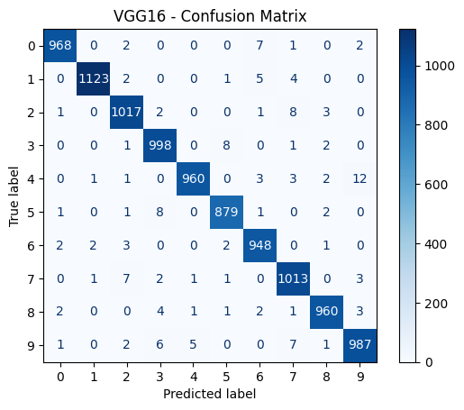
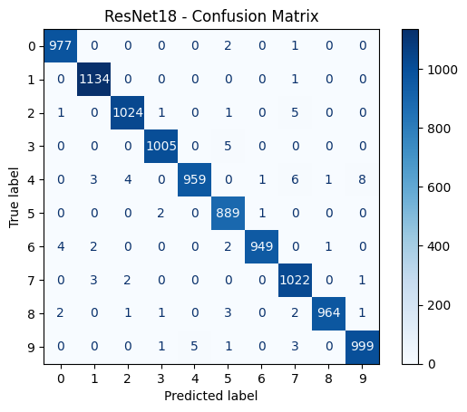
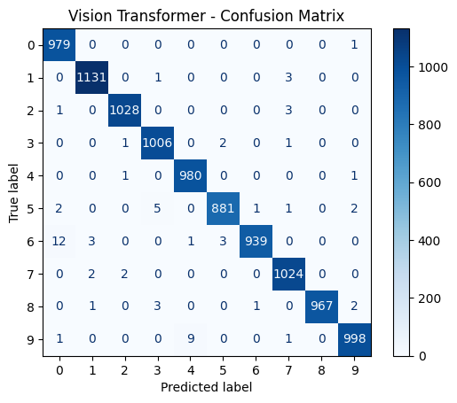

https://brick-24.github.io/PBL/

# MNIST Digit Classification

This project uses pretrained deep learning models to classify handwritten digits from the MNIST dataset.

Instead of training networks from scratch, I fine-tuned modern vision models (VGG16, ResNet18, and a Vision Transformer) that were originally trained on ImageNet. The goal is to compare their performance on MNIST and visualize results using confusion matrices.

---

## Dataset

The project uses the MNIST handwritten digit dataset provided by torchvision.

MNIST contains:

- 60,000 training images  
- 10,000 test images  
- Digits from 0–9  
- Original size: 28×28 grayscale  

Because the pretrained models expect ImageNet-style input, each image is:

- Resized to 224×224  
- Converted from grayscale to RGB (3 channels)  
- Normalized  

This allows ImageNet-pretrained networks to be reused directly on MNIST.

---

## Models

The following models were trained:

- VGG16  
- ResNet18  
- Vision Transformer (ViT Tiny)

All models were initialized with ImageNet weights, then modified to output 10 classes (digits 0–9).

Training was done for 5 epochs using Adam and cross-entropy loss.

---

## Results

Typical test accuracy after training:

- VGG16: ~98.5%  
- ResNet18: ~99.2%  
- Vision Transformer: ~99.3%  

Confusion matrices are generated for each model and included below.

### VGG16 Confusion Matrix

---

### ResNet18 Confusion Matrix

---

### Vision Transformer Confusion Matrix

---

## YOLO + ViT (Experimental)

An optional pipeline uses YOLO to detect digit regions before passing the cropped image to the Vision Transformer.

If YOLO fails to detect anything, the full image is used.

This was mainly exploratory and included to test detection + classification workflows.

---

## Saved Models

Trained models are saved as:

State dictionaries:

- vgg_mnist.pth  
- resnet_mnist.pth  
- vit_mnist.pth  

Full models:

- vgg_mnist_full.pth  
- resnet_mnist_full.pth  
- vit_mnist_full.pth  

---

## Notes

models aren't uploaded to github due to their file size

